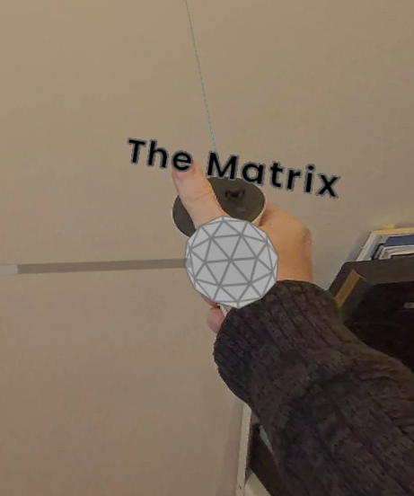
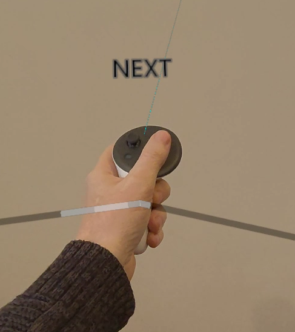

# grapho-user-guide

User guide for the Grapho data science + storytelling toolkit

# Table of Contents

- [Introduction](#introduction)
- [Grapho XR](#grapho-xr)
  - [Quickstart](#quickstart-for-grapho-xr)
  - [User Interface](#user-interface)
  - [Controls](#controls)
- [Grapho Machine](#grapho-machine)
- [Online Services](#online-services)
  - [Dashboard](#dashboard)
  - [API](#api)
  - [Integrations](#integrations)
- [Mixed Reality](#mixed-reality)
- [Troubleshooting](#troubleshooting)
- [Use Cases](#use-cases)
- [Support](#support)
- [Change Log](ChangeLog.md)

# Introduction

Welcome to the user guide for [Grapho](https://grapho.app) - a toolkit for data science + storytelling.

* standard interaction mechanics across different data sets and applications
* easy-to-use desktop, mobile and XR features
* convenient hosting options
* developer-friendly integrations with Neo4j, python and Unreal Engine

In 2024 data science is having a moment with the explosion in generative AI fuelled by deep learning techniques and vast data collections. But the reality is that for all the technical advances, it comes back to humans. How are we collecting data? Why are we collecting it? What are our motivations for using it? How do we communicate? Getting to grips with modern data still requires that ancient skillset we've evolved - storytelling - and how we tell stories is changing. 

This toolkit is for anyone anyone working with graph data. It empowers users to create data stories on any platform including spatial computing. It lets you draw connections in real-time within immersive virtual worlds. Explore and query graphs using parameters relevant to you. Grapho productivity tools make taking a deep dive into complex data sets more accessible and engaging. It brings connections to life.  

[Contact us](https://mod.studio/where/) for more information.

See the [Grapho Developers Guide](DevelopersGuide.md) for more information on preparing data and systems for Grapho.

Return to [Table of Contents](#table-of-contents).

## Benefits

* Harness public and private domain knowledge
* Fine tune your data for AI and ML training
* Improve evaluation of complex systems and processes
* Improve explanability of your insights

Why "data science + storytelling"?

Data is about people. Your people must understand the story your data is telling. As data scientists lean further into the astonishing power of Machine Learning, a one-size-fits-all automated approach is inadequate. In the age of AI, coherant storytelling is more valuable than ever.

* Data management (leadership)
* Data architecture (documentation and mapping)
* Data design (analysis and visualisation)
* Data engineering (building)
* Data operations (maintaining)
* Data science (research and development)

## History

Grapho started life as a spatial knowledge graph interface for a VR documentary [A Clever Label](https://acleverlabel.com) released on Steam in 2021 using a Neo4j backend. This was then spun out as a white label tool  [Grapho XR](#Grapho-XR) in 2022 for knowledge graphs. Our first customer was [APNIC](https://www.apnic.net/). 

In 2024 [ISO 76120 - Graph Query Language (GQL)](https://www.iso.org/standard/76120.html) was published - the first database query language standard in 37 years since SQL. This provides a future-proof way of defining data structures and basic operations on property graphs. GQL is largely based on Neo4j's [CYPHER](https://neo4j.com/product/cypher-graph-query-language) language.

In 2024 the Grapho service offering was expanded to applied data science including deep learning model creation and training. 

Return to [Table of Contents](#table-of-contents).

# Roadmap

Grapho is available through Mod's SaaS and consulting service.

[Grapho XR Roadmap](https://trello.com/b/aIg9JRxM/grapho-roadmap-graphoapp)

Return to [Table of Contents](#table-of-contents).

# Grapho XR

Grapho XR is a spatial graph visualisation tool and a new way to manage and present graph data. 

It's an interactive experience that feels like [Minority Report](https://en.wikipedia.org/wiki/Technologies_in_Minority_Report#Gesture_recognition) meets [60 Minutes](https://en.wikipedia.org/wiki/60_Minutes). Grapho provides flexibility to switch between data sets and between visual themes, ensuring the look is right for your audience. Display and take control of your data. Share knowledge in a hands-on intuitive way. Use it on-set as an interactive in-camera VFX solution. 

See also
* ["Grapho - graph production technology"](https://vimeo.com/776827140) explainer video.
* Our SIGGRAPH2022 paper [A Clever Label: Multi-sensory VR data visualization for art, productivity and communication](https://dl.acm.org/doi/fullHtml/10.1145/3532834.3536206)
* [Screenshots on Flickr](https://www.flickr.com/photos/modproductions/albums/72177720306315648)

Return to [Table of Contents](#table-of-contents).

## Quickstart for Grapho XR

### Installation 

#### PCVR

* Run Meta Quest Link for Windows 
* Connect your Quest to PC via OculusLink (USB-C cable) or AirLink (Wifi gen6 only)
* Unzip Grapho build ZIP
* Run Grapho.exe direct or use provided BAT file to specify VR or Desktop mode
    * RunGraphoVR.bat
        * `start ./Grapho.exe -vr` (default)
    * RunGraphoDesktop.bat
        * `start ./Grapho.exe -noxrstereo` (Desktop is for users without VR)

#### Mobile VR

* Connect your Quest to PC USB-C cable
* [Enable Developer Mode](https://developer.oculus.com/documentation/native/android/mobile-device-setup/)
* Install [SideQuest](https://sidequestvr.com/) (unless you already have Android Studio or even just adb installed)
* Unzip Grapho XR build ZIP
* Install the provided APK via SideQuest using "Install APK from file" (right of WIFI icon)

Return to [Table of Contents](#table-of-contents).

### Induction

Grapho XR is configured by default with a "demo" graph database - a small set of actors & movies in cross-referenced pop culture 

* Enable [PASSTHROUGH](#passthrough) mode with the FACE BUTTON #2 button
* Reach out and grab the object labelled "Enter The Matrix" with the [GRAB](#controls) button
* Flip this "Handle" upside down to [open the graph](#open-graph)
* Grab the spherical nodes (and the relationship lines connecting nodes) with the GRAB button
* Use the joystick to [TELEPORT](#teleport)
* Use [FORCE PULL](#force-pull) to grab nodes at a distance - point at node, press TRIGGER button, flick wrist upwards, release TRIGGER
* Switch to another sample database using the [Settings Menu](#settings-menu)
    * Press the SETTINGS button on left controller
    * Select a different Database
    * Press the SETTINGS button again to return to the level
* See [explainer video](https://vimeo.com/943161258/f7311ebf2c) demonstrating the above core mechanic using Meta Quest 3

Return to [Table of Contents](#table-of-contents).

## System Requirements

Grapho XR builds are available for the following platforms.

* PCVR
* Mobile VR

Return to [Table of Contents](#table-of-contents).

### PCVR

* Windows 10 or 11
* 16 GB RAM or better
* Intel Core i7-3930K/AMD FX 8350 equivalent or better
* NVIDIA GeForce GTX 970, AMD Radeon R9 290 equivalent or better
* 1 GB available space
* Supported
    * Quest 2 / Quest Pro / Quest 3
    * Valve Index
    * HTC Vive / Vive Pro / Vive Pro 2 / Vive Focus 3 / Vive Elite XR

NOTE Grapho XR's "desktop mode" (non-XR) support on Windows is provided for backwards compatibility, accessibility, and testing. We only recommend use of 3D visualisation on 3D displays for professional use given given research findings that 2D visualisation works better on a 2D displays. See [Dashboard](#dashboard) options for off-the-shelf and custom options. 

### Mac OS

* Coming soon
    * Apple Vision Pro

### Mobile VR

* Supported
    * Quest 2 / Quest Pro / Quest 3
    * Vive Focus 3 / Vive Elite XR
  Coming soon
    * Apple Vision Pro

Controllers are currently required. Hand tracking support on request. 

We don't currently recommend hand tracking for precise manipulation of graph data for professional use.

Return to [Table of Contents](#table-of-contents).

## Development Frameworks

Grapho XR plugins and a separate Grapho Development Guide are provided to licensees for third party development with the following frameworks 

* [Unreal Engine](https://unrealengine.com/) 5.4

Return to [Table of Contents](#table-of-contents).

## User Interface

The Grapho UI has the following key components

* Handle

A Handle is a special type of node that is a convenient handle to a section of a graph that speeds up navigation and helps manage clutter.

Think of it as a pointer or a bookmark to a particular spot in a the graph.  

* Node

The graph is made up of Nodes

* Relationship

Connections between nodes are relationships (or links)

* Datapad

Nodes properties (anything from multimedia to a simple list of text) appear on an attached surface - the data pad.

* Context Menu

Context menus allow you to perform actions on a particular node.

Return to [Table of Contents](#table-of-contents).

## Controls

Meta Quest Touch Controller layout

### Passthrough 

**Passthrough camera support is available on Quest and Vive mobile headsets but not on Windows. 

See [Mixed Reality](#mixed-reality) for PCVR camera support for combining greenscreen live action footage and Grapho visualisation**

Toggle FACE BUTTON #2 button to switch between virtual environment and passthrough (see the real world through the onboard cameras). Passthrough (sometimes called Mixed Reality) can be great for new users unfamiliar with VR.

TIP Use this if real world surroundings make it too hard virtual objects.

### Teleport

Push LEFT or RIGHT joystick forward to show reticule and direction arrow on the ground plane. Rotate joystick to change direction of the arrow. This determines what direction you teleport. Release joystick to teleport. 

NOTE Users new to VR can get confused if they trigger teleport by mistake. You can change Settings > Teleport delay to adjust how responsive the joysticks are if this is a problem. 

### Grab

Use GRIP button to grab object (handle, node, relationship).

### Force Pull

Force pull is a telekinesis-like feature that lets you quickly grab an object regardless of its distance from you.

VR mode:
* Force pull - select object with the laser point extending from your virtual hand, pull TRIGGER and flick your wrist upward or to the side (like pulling a line on a fishing rod)
Desktop mode:
* Grab a node from a distance pressing G key and it will be force pulled towards the camera automatically

### Bump

Use natural hand movements to move objects out of the way

### Open Graph

Grab Handle. Flip Handle upside down to open graph nodes (run a query).

Flip again to close graph nodes.

### Open Node

Press TRIGGER button to toggle opening and closing of a node to reveal its "Datapad" which shows the properties of a node. 

Settings > Open Datapad on Grab checkbox controls whether this happens automatically on GRAB. It can get annoying sometimes to have this on but useful as a default for new starters.

### Open Context Menu

Additional functionality is available while holding a node.

GRAB + <FACE BUTTON #1> opens a floating menu of buttons  

While keeping buttons pressed, move hand over the buttons to highlight them

Release <FACE BUTTON #1> to select highlight action.

Move your hand off the menu and release <FACE BUTTON #1> to close menu without doing an action.

#### Expand

Context Menu > Expand 

Any neighbouring node not already visible are spawned

#### Collapse

Any neighbouring node that was previously expanded (but not part of original query) is hidden

#### Hide

The node is hidden. 

To reveal node again you currently have to Close Graph and Open Graph again using the Handle

#### Hide Unselected

#### Pin
The node is pinned in place - moving neighbouring parts of the graph will have no effect on it

#### Unpin

The node is unpinned - moving neighbouring parts of the graph will effect its position

#### Bookmark

Not yet implemented. Sorry about that!

#### Settings Menu

Press SETTINGS button on Left Controller

NOTE - Changed settings are saved to your local device. There is currently no Reset Settings feature

* Restart (button) - restart application
* Arrange by type (toggle) - Check this to cluster all nodes by their given types (labels in Neo4j speak).
* Max nodes (spinbox) - limit how many nodes can be displayed at any time
* API URL (list) - choose from available Grapho API servers
* Database (list) - choose from available graph databases (per server)
* Refresh API (button) - re-run query. Useful for network troubleshooting
* Mouse Sensitivity - for desktop mode only
* Movement Speed - for desktop mode only
* Teleport Delay - increase delay to prevent accidentally use of teleport

Return to [Table of Contents](#table-of-contents).

## Spectator Mode

### Windows ###

The PCVR build of Grapho XR supports having a separate virtual camera with desktop user controls (separate view to what VR user can see) for collaborations.

CONTROL + S - Toggle Spectator Camera

WASD keys to move camera

### Meta Quest ###

Spectator mode is not yet available for mobile VR.

However using [Meta Quest Developer Hub](https://developer.oculus.com/meta-quest-developer-hub/) > Casting > Start Forwarding Camera Input you can now remote operate the Quest virtual camera. 

WARNING - do not attempt to use this while someone is wearing the HMD as this can make them very sick!

# Grapho Machine

Grapho Machines (GMs) are re-distributable applications and online services. They are how we build, deploy, distribute and operate services in a standard way. There is no one-size fits-all approach that will work for all use cases so GMs provide an abstraction layer for delivering services across a variety of platforms as required.

GMs include

* functionality - instances of any bundled applications and services
* data - preset data, instance-generated data

GMs support a variety of container and virtual machine formats for use on your local device, on-premises hosting or on cloud platforms. 

We use packer and terragrunt to maintain [Infrastructure as Code](https://en.wikipedia.org/wiki/Infrastructure_as_code) definitions of all Grapho components to automated creation of Grapho Machine instances and GM variants for multiple platforms as required.

e.g. a Grapho Machine might be created as
* AMI for use on AWS
* VHD for use on a local Windows machine
* PVM for use on a local Mac machine

Supported:

* Virtual Machine Image Formats
    * AMI
    * VHD
* Containers
    * Linux Containers (LXC)
    * Docker
    * Virtual Box
    * VMWare

[Contact us](https://mod.studio/where/) to discuss how we can accomodate any new infrastructure requirements not on this list.

The default Grapho Machine is currently a Linux Debian instance that hosts LXC Containers based on the [Academy Software Foundation's VFX Reference Platform](https://vfxplatform.com/).

See the [Grapho Developers Guide](DevelopersGuide.md) for more information on preparing data and systems for Grapho.

Return to [Table of Contents](#table-of-contents).

# Online Services

## Dashboard

Grapho provides useful screens for managing your data whether these are off-the-shelf integrations or custom built for specific use cases from popular frameworks. 

e.g. [Neo4j Neodash Dashboard Builder](https://neo4j.com/labs/neodash/)

See our list of [Integrations](#integrations) available below and [contact us](https://mod.studio/where) for any new integration requirements you might have.

Return to [Table of Contents](#table-of-contents).

## API

grapho-server is a sample python REST API service available to Grapho customers

This provides a thin abstraction layer to help manage vendor lock-in and provide data to Grapho applications in a consistent manner as part of a manageable pipeline.

Features
* OpenAPI compliant documentation
* REST API endpoints for graph database queries
* Mux database queries (e.g. CYPHER, SQL) with local config
* Support for running on local desktop, on-premise hosting and cloud platforms

Public release COMING SOON

### demo.grapho.app

[Grapho XR](#Grapho-XR) default configuration includes this public instance of the Grapho API. It provides access to sample data sets.

See also
* [https://demo.grapho.app/docs](https://demo.grapho.app/docs)

Return to [Table of Contents](#table-of-contents).

## Integrations

* Neo4j
    * Community Edition - v4.4, v5
    * Enterprise Edition - v4.4, v5
    * Plugins
        * Bloom
      * GDS
      * APOC
    * Neodash
* Streamlit
* Gradio
* Jupyter
* Django
    * Wagtail

Return to [Table of Contents](#table-of-contents).

Formats

* JSON
* CSV
* VCF

Platforms

* Neo4j Aura
* Amazon AWS
* Google Cloud
* Microsoft Azure
* ZohoCRM
* Twitter
* Facebook
* Discord

Graphics Engines

* Unreal Engine
* Houdini
* Touch Designer
* Blender

Return to [Table of Contents](#table-of-contents).

# Mixed Reality

## LIV 

Grapho XR PCVR supports the LIV Mixed Reality for real-time live action video integration.

# Use Cases

Grapho has been deployed for a variety of use cases across major projects in different sectors.

* Organisational knowledge & asset management
* Topological machine learning
* Collection management
* Data activation
* Training & simulation
* Production knowledge management
* Narrative design & worldbuilding

## Sectors

* Enterprise knowledge management
* Cultural heritage
* Media & entertainment
* Video games
* Civil engineering

## Case Studies

*Asia-Pacific Network Information Centre (APNIC)*

The APNIC Visualisation Tool was built with Grapho XR to provide internal staff with a resource for network graph exploration and analysis on desktop and in VR. 

*Parramatta Light Rail*

Grapho tools were used to model and illustrate the complex interplay between people, processes and technology for the Software Management Plan.

*Japan Broadcasting Corporation (NHK)*

Grapho was used to design and prototype a digital human agent that communicated in Japanese sign language on broadcast TV.  

*National Film & Sound Archive (NFSA)*

Grapho tools are being used to update the service framework for Australia's national multimedia collection, including a knowledge graph and a topological machine learning pipeline.

*A Clever Label*

Grapho XR's first iteration was as the core mechanic behind Mod's VR investigative documentary, (A Clever Label (2021))[https://acleverlabel.com], available on Steam.

# Troubleshooting

We're here to help.

For general issues on Grapho or this documentation, use [https://github.com/modprods/grapho-user-guide/issues](https://github.com/modprods/grapho-user-guide/issues) or contact your Grapho account manager.

Return to [Table of Contents](#table-of-contents).

# Support

Email - support (AT) grapho (DOT) app

Discord - post in channel #grapho on [Mod's Discord server](https://discord.gg/PPCaQD2)

