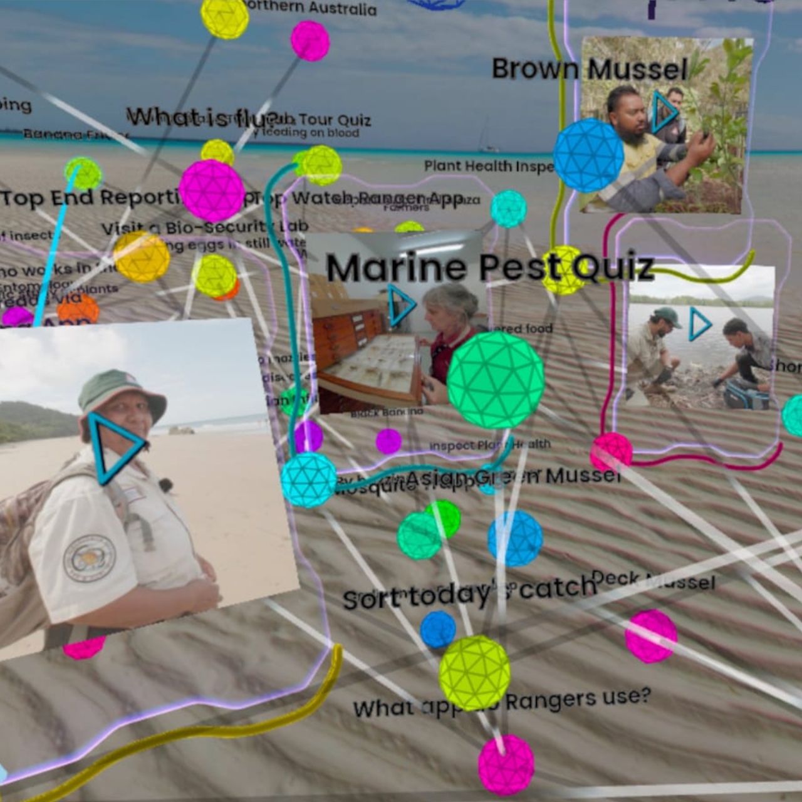

# Developer Guide

<!-- WARNING: THIS FILE WAS AUTOGENERATED! DO NOT EDIT! -->

<figure>

<figcaption aria-hidden="true">graphobymod-black</figcaption>
</figure>

Developer guide for the Grapho data science + storytelling toolkit

# Grapho XR

See [Grapho User Guide](README.html) for non-developer documentation.

# Properties

Grapho is designed around the power and simplicity of property graph
databases. ie. where both database nodes and relationships (edges) can
be assigned key / value properties.

Your source data does not necessarily need to be stored in a graph
database but if it is, you can take immediate advantage of Grapho tool
features

The following table sets out the Grapho visualisation schema

## node

### labels

The following Label types have specific implementations

<table>
<colgroup>
<col style="width: 31%" />
<col style="width: 68%" />
</colgroup>
<thead>
<tr>
<th>Label</th>
<th>Description</th>
</tr>
</thead>
<tbody>
<tr>
<td>Handle</td>
<td>Handles are core to Grapho and the starting point for your XR graph
journey. As such they are rendered differently from all other nodes.
Think of a Grapho Handle as a pointer or a bookmark to a particular
place in your graph. Use Handles to create deep links into your graph,
to support editorial process (handles play nicely with NEXT
relationships for curated paths through your data) and help manage
clutter. Handles can be saved to your database or generated on the fly
from dynamic query logic. See <a
href="https://docs.grapho.app/#user-interface">Grapho XR UI
documentation</a></td>
</tr>
</tbody>
</table>

### properties

The following properties have specific implementations

<table>
<colgroup>
<col style="width: 13%" />
<col style="width: 4%" />
<col style="width: 7%" />
<col style="width: 74%" />
</colgroup>
<thead>
<tr>
<th>name</th>
<th>type</th>
<th>e.g.</th>
<th>description</th>
</tr>
</thead>
<tbody>
<tr>
<td>name</td>
<td>str</td>
<td>“My node”</td>
<td>used as default label</td>
</tr>
<tr>
<td>colour OR color</td>
<td>str</td>
<td>“#ffffff”</td>
<td>override colour style</td>
</tr>
<tr>
<td>voiceover_override</td>
<td>bool</td>
<td>true</td>
<td>if true, voiceover is allowed to interrupt current voiceover,
otherwise this is queued</td>
</tr>
<tr>
<td>voiceover_url</td>
<td>str</td>
<td>https://d1pxeqjdb63hyy.cloudfront.net/media/media/test-ux.ogg</td>
<td>plays voiceover when node opened. Supports WAV, MP3, and OGG
formats</td>
</tr>
<tr>
<td>image_url</td>
<td>str</td>
<td>https://d1pxeqjdb63hyy.cloudfront.net/media/images/node_end-to-end-testing.original.png</td>
<td>displays image when node opened. Supports JPG, PNG</td>
</tr>
<tr>
<td>subtitles_url</td>
<td>str</td>
<td>https://mod.studio/documents/64/test-ux.vtt</td>
<td>displays subtitles when node opened - if voiceover_url available.
Supports VTT and SRT formats</td>
</tr>
</tbody>
</table>

## relationship

### properties

<table>
<colgroup>
<col style="width: 20%" />
<col style="width: 16%" />
<col style="width: 16%" />
<col style="width: 45%" />
</colgroup>
<thead>
<tr>
<th>name</th>
<th>type</th>
<th>e.g.</th>
<th>description</th>
</tr>
</thead>
<tbody>
<tr>
<td>colour OR color</td>
<td>string</td>
<td>“#ffffff”</td>
<td>overrides colour style defined in the app</td>
</tr>
</tbody>
</table>

 *Screenshot:
Northern Biosecurity Training graph*

<!-- # Console Variables -->

# Grapho Machine

## Environment Settings

Grapho Machine tools are typically preset with credentials to your
database instances in a .env file.

When building a Grapho Machine from scratch, copy the env.sample file in
each component to .env and fill in your real credentials.

## grapho-server

grapho-server is a lightweight reference API server for the
[GraphoXR](README.html#grapho-xr) spatial browser.

Source code and documentation is available at
<https://github.com/modprods/grapho-server>

Features

- OpenAPI compliant documentation
- REST API endpoints for graph database queries
  - all - load all editorially curated paths (via their “handles”)
  - game - load a complete graph for offline use
- Mux database queries (e.g. CYPHER, SQL) with local config
- Support for running on local desktop, on-premise hosting and cloud
  platforms

Handles

“Handles” are the mechanism by which editorially curated paths through
your graph data are served to Grapho clients like
[GraphoXR](README.html#grapho-xr).

Use Handles to design, curate and manage your graph data experiences.

Handles are simply nodes with the label “Handle”. They have special
significence and are [rendered differently](README.html#handle) to other
[nodes](README.html#node).

Use Handles to \* The /all REST API method returns all Handles in the
database \* By default, selecting a Grapho database in Grapho XR will
spawn all Handles as [Tron-like disks](README.html#handle). \* [Opening
a Handle](README.html#open-graph) in a Grapho client will reveal all
nodes linked to this Handle. \* Handles can be configured to serve any
style of data \* By default Handles are configured to \* Return the path
of all nodes connected to me via the relationship NEXT \* Return all
nodes that are linked to this path by no more than 1 node (i.e. distance
= 1)

### grapho-server quickstart

To start exploring your own data, try creating a Handle linking to an
existing node in your database.

Set up your own Grapho XR experience from scratch, all you need is a
recent Meta Quest headset and the following free resources.

1)  Run Neo4j Desktop

- On your desktop or laptop
  - Download and install Neo4j Desktop
  - Create and run a new Neo4j database
  - Open the database (with Browser)
  - Click Guides
  - Click “:guide movie-graph”
  - Click “Next”
  - Click PLAY icon in the code block
  - Note the new “Node labels” and “Relationship types” appearing under
    “Database Information” (left column)
  - Copy the following CYPHER query into the Neo4j Browser CLI

<!-- -->

    // Merge first handle
    MERGE (n:Handle {label:'Enter the Matrix'})
    SET n.name = n.label
    WITH n
    MATCH (o:Movie {title:a'The Matrix'})
    MERGE (n)-[:NEXT]->(o)
    RETURN n, o

- - Click the RUN icon (blue arrow to the right of prompt)

2)  Run grapho-server container in Docker Desktop

See README in grapho-server repo

<https://github.com/modprods/grapho-server>

3)  Run Grapho XR Demo on Meta Quest HMD

- Open Browser
- Confirm you can access grapho-server URL (you may need to give
  permission for “unsafe” URL)

<!-- -->

    i.e.
    http://<YOUR SERVER LAN IP>:5042

- Copy URL
- Install and run the free [Grapho XR Demo](README.html#grapho-xr-demo)
  from Meta Store
- Press SETTINGS button (three vertical lines) on left controller
- Click “Paste” button under API_ROOT_URL
- Select your database name under Database
- Press SETTINGS button to close panel
- \<the “Enter the Matrix” handle should spawn\>
- Use GRAB button to grab handle and flip it over to open

You now have your own Grapho service equivalent to
[demo.grapho.app](README.html#demographoapp).

See /deploy in source code for example configurations when using
grapho-server in production.

See [Properties](#properties) for how to prepare your graph for use in
Grapho.
